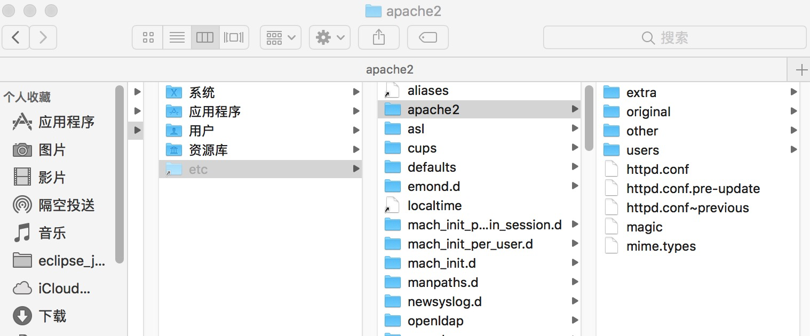
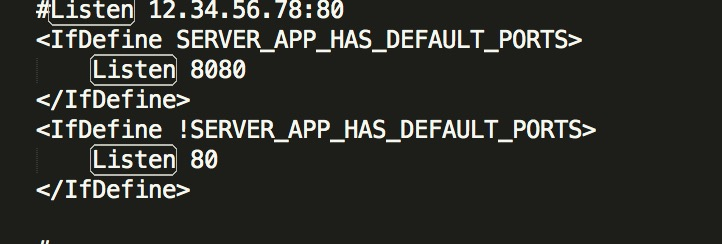
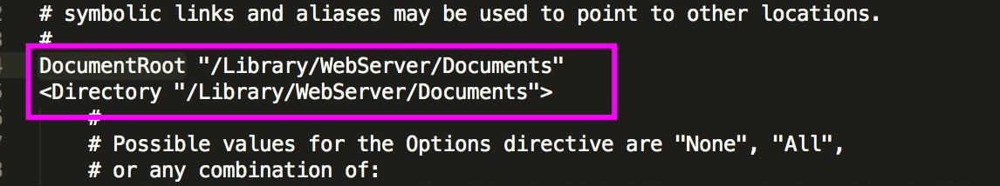
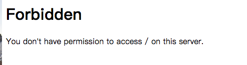
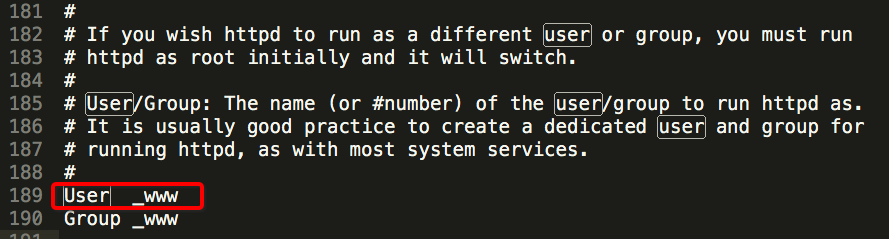
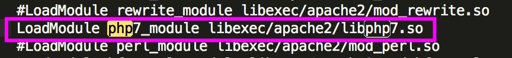
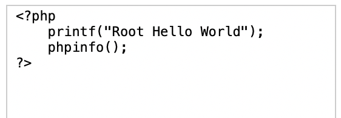
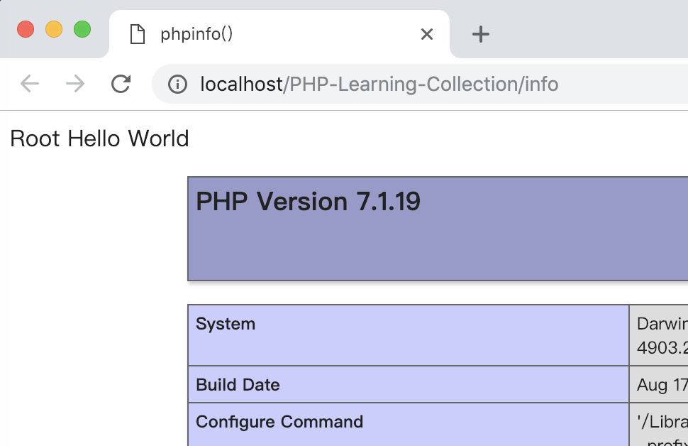

### 搭建服务器Apache
------

>Mac上自带**Apache**和**PHP**，我们可以直接使用，这点还是很方便的，点赞✨✨✨

### 开始干

* 开启Apache服务

```
sudo apachectl start
```

* 常用命令

```
sudo apachectl start    //开启服务
sudo apachectl restart	//重启Apache服务  
sudo apachectl stop     //停止Apache服务  
sudo apachectl -v       //查看服务版本  

```

* 查看服务是否开启

>浏览器中输入localhost:80（80是默认端口），如果浏览器中显示 It Works！则证明Apache服务开启成功。

* 查看配置文件

>Apache服务的默认安装路径是/etc/apache2，在Finder下使用快捷键 command+shift+g，然后输入/etc 回车，就会看到apache2目录



* 修改端口号

> 打开httpd.conf配置文件，搜索Listen 80，修改成你想要的端口号即可（注：对配置文件修改过后要一定要重启Apache服务）



* 默认部署路径

>  Apache服务部署路径: **/Library/WebServer/Documents** 

* 修改默认部署路径

> 打开httpd.conf配置文件，搜索DocumentRoot ，更改路径，重启服务



#【重点】
这里面我修改了路径，重启服务，出现了Apache错误提示



**解决方法**

打开配置文件httpd.conf,搜索User关键字，如下图所示



User和Group默认都是_www,但是当前用户并不一定是_www,这就要修改用户和组中的权限问题

设置 User 为当前电脑的userName，保存设置 ，重启服务，解决！！！

* 配置PHP

> Mac自带有PHP，只需要在在Apache服务中配置一下即可直接使用。
> 在打开httpd.conf配置文件，搜索LoadModule php，找到LoadModule php的所在行，把前面的#号去掉，保存后重启服务即可，没毛病。



* 测试

> 创建info.ohp 文件，放到部署路径下



> 浏览器访问结果如下，恭喜你成功入坑💐👏



> 关于Apache暂时先介绍到这里，先让我们代码跑起来就OK，
> 现在公司更多的会用nginx，先有个印象之后用到再做分享。


