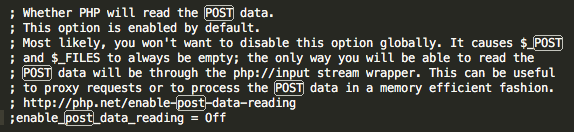
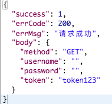
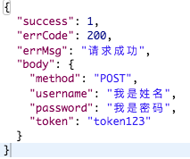

### 服务端接收访问数据
------

* 示例代码index.php

1. 接收GET请求参数
2. 接收POST请求参数
3. 接收Headers自定义参数

###问题

1、接收不到POST请求参数

解决办法：<br>

```
1、打开/etc/php.ini配置文件
2、设置 enable_post_data_reading = On
3、重启服务器

```



##疑问
目录结构如下


同样是post请求，如果我用**localhost/02**访问，返回如下：


如果我用**localhost/02/index**访问，返回如下：


###这是为什么？？？希望大家知道原因，能给我指点下，谢谢！

