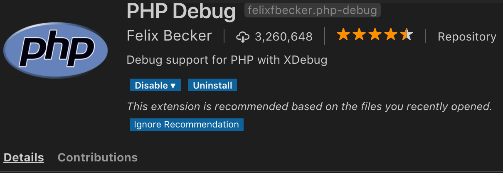
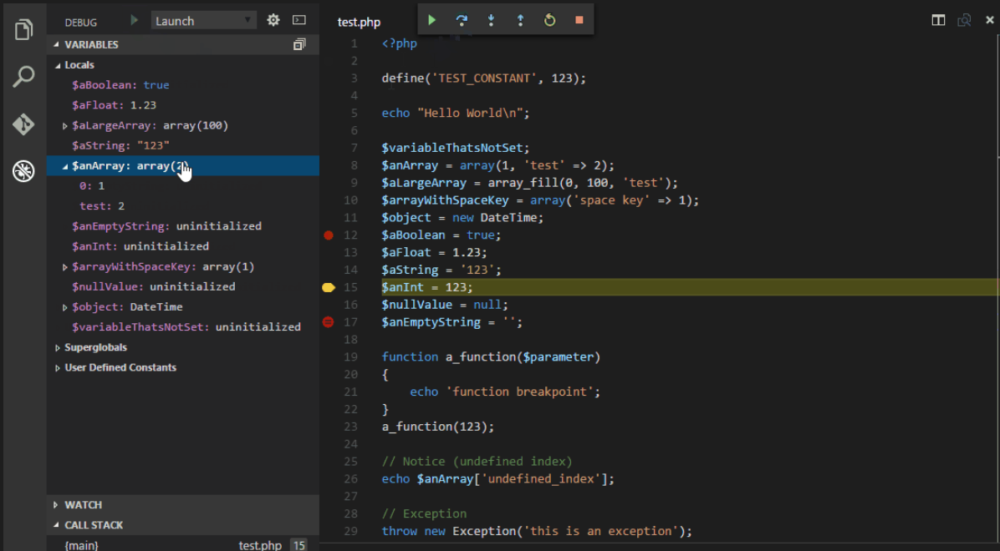
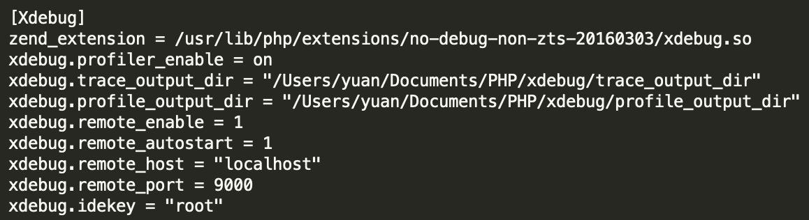
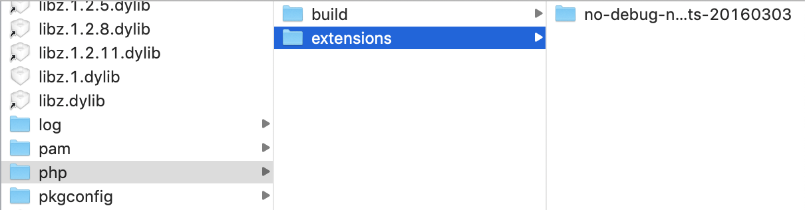
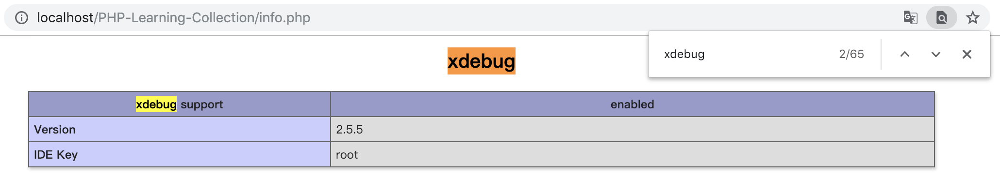
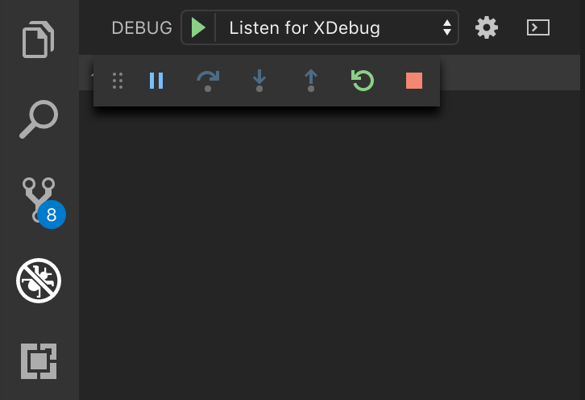

### VSCode + xdebug调试
------

>编码过程少不了调试，合理运用调试工具会给你增加编码效率，一个好的调试工具也会给你带来编码乐趣，增加处理bug的效率，这里我首选**xdebug**

### 安装插件

1、配合VSCode安装很方便，搜索直接**install**就行，使用方法动图介绍很详细

### 配置

1、打开配置文件 **/etc/php.ini** 使其加载xdebug这个扩展

2、**zend_extension** 具体路径根据 **/usr/lib/php/extensions** 路径下名称填写即可

3、保存配置，重启服务

### 测试

1、浏览器打开info.php，如下显示则表示配置成功💯

### 使用

1、需要调试的时候点击左边的debug，运行即可

