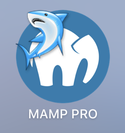
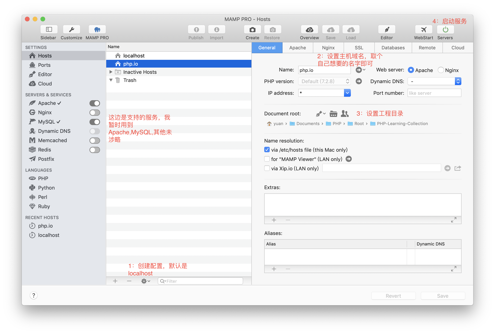
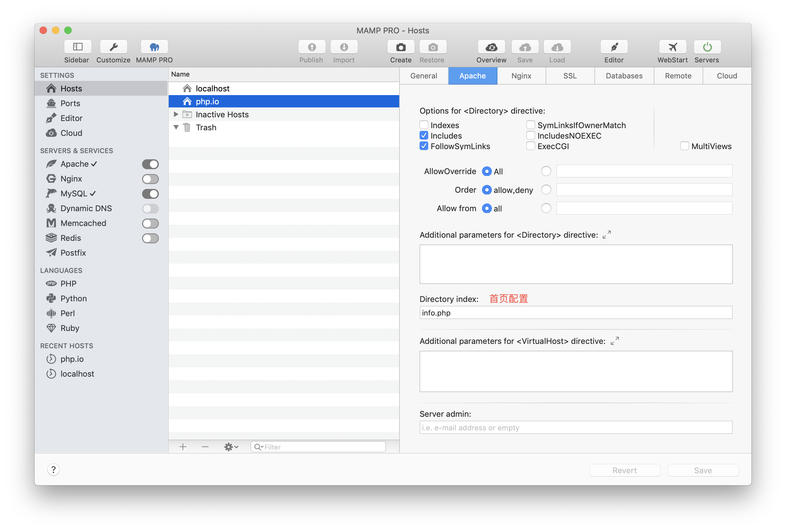
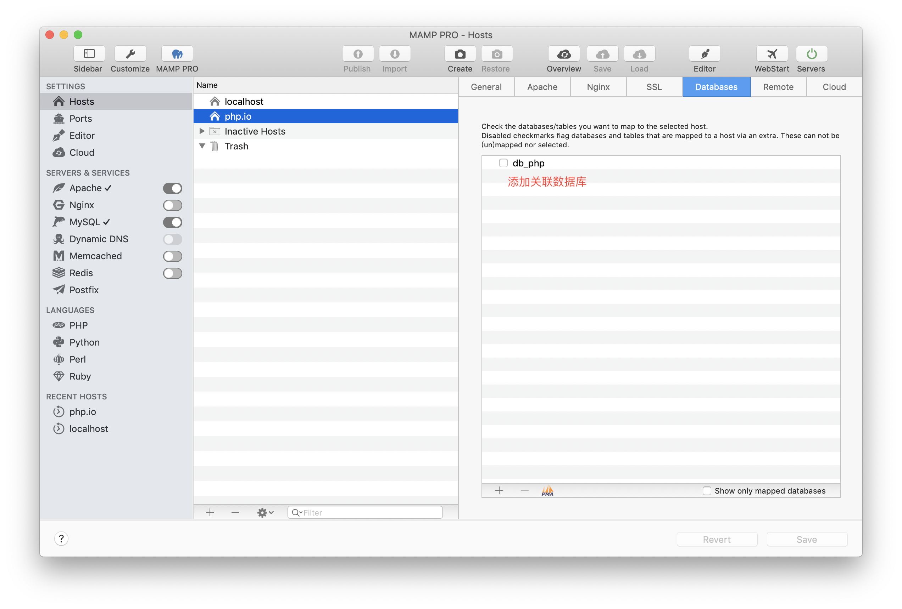
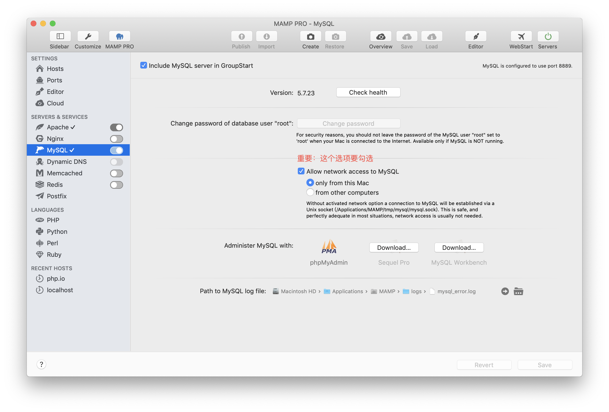
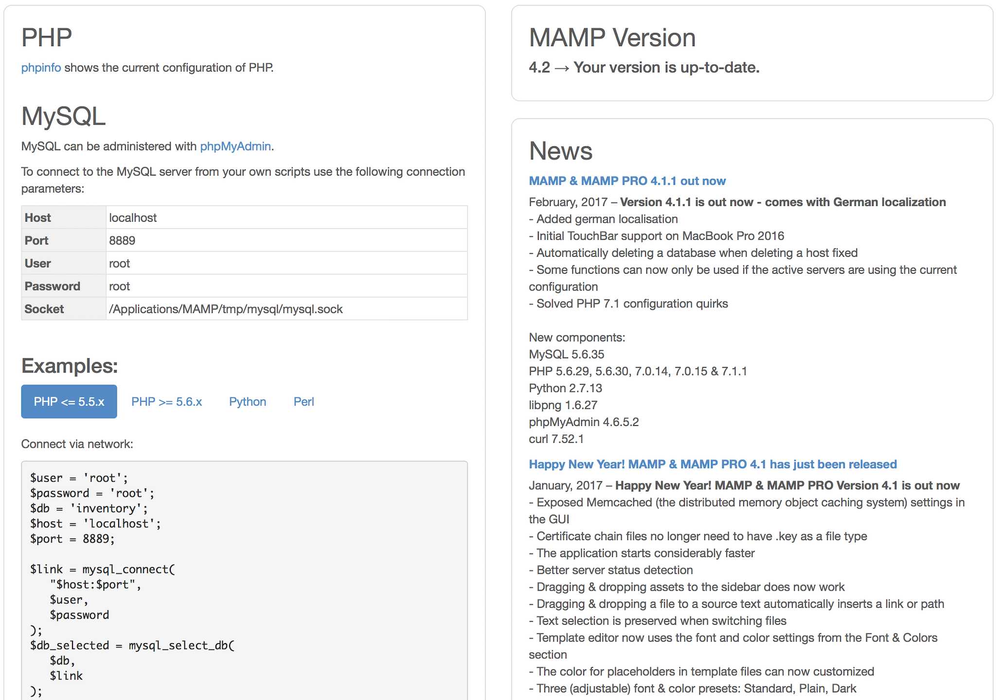
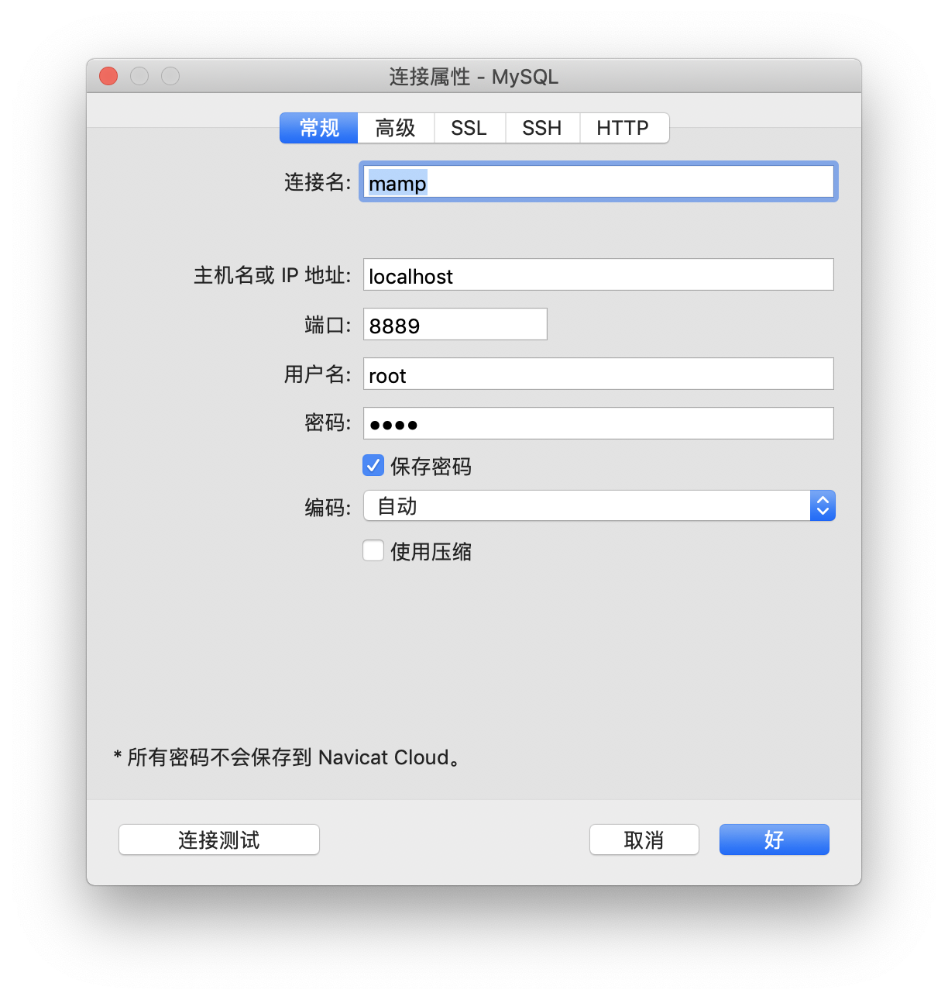
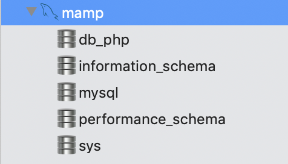
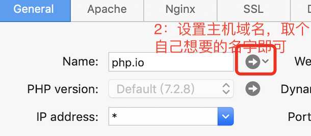
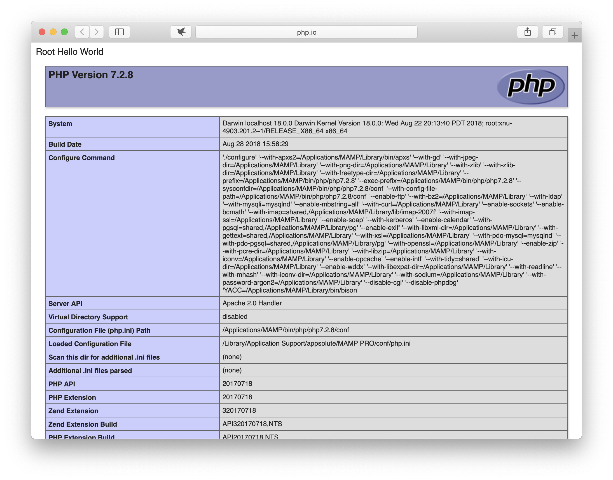

### MAMP 统一集成管理工具
------

>MAMP是一个集成Apache、Nginx、MySQL、Redis、Memcached等平台的统一管理工具，方便使用，提高效率，对于这样的好东西，五星推荐。

[访问官网](https://www.mamp.info/en/)

我用的是[MAMP-PRO-5.1破解版下载链接](https://pan.baidu.com/s/1qFpv8TcjowotbtqtPOoWHw) 密码:u3re

需要的小伙伴自行下载

#### 一、打开App

#### 二、配置域名和工程目录

#### 三、首页配置

#### 四、端口设置

#### 五、添加关联数据库

* 查看MAMP连接设置

* 配置数据库连接参数

* 数据库连接

#### 6、查看首页

* 启动服务，点击按钮，查看首页
 

* 服务启动成功
 

#### 【注】功能很多，未能实践所有的功能，待用到了完善