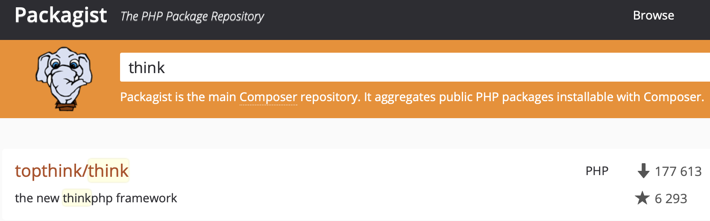
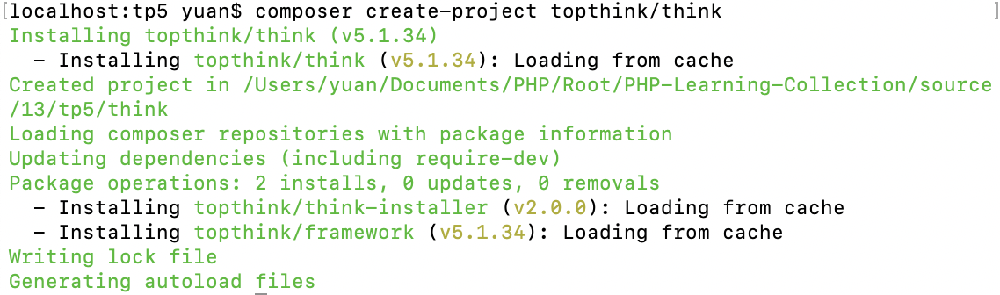
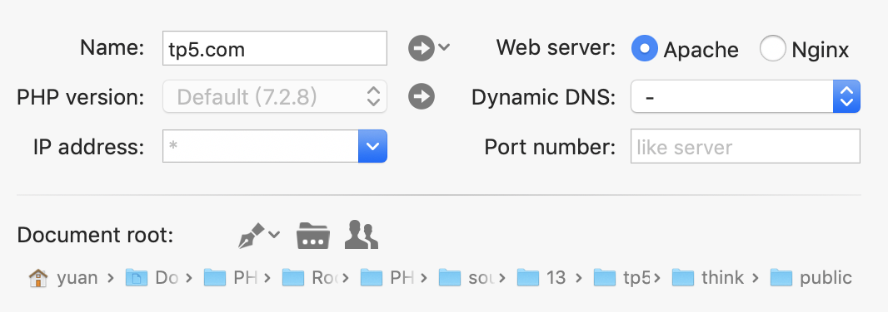
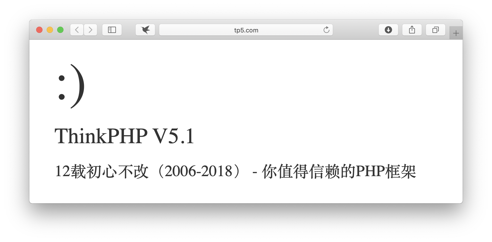

# ThinkPHP安装与运行流程
---

### 一、Composer安装ThinkPHP

1、**Composer全局安装：**使composer命令在任何目录下都可以使用（不清楚的同学可以查看我之前对Composer的使用介绍或查看[官网说明](https://www.phpcomposer.com)）

2、**安装中国全量镜像：**大幅提升国内访问速度

```
composer config -g repo.packagist composer https://packagist.phpcomposer.com
```

3、**搜索安装包：**[https://packagist.org/](https://packagist.org/)



4、**开始安装：**

```
/*
进入项目目录
*/
composer create-project topthink/think
```

* 安装完成



5、**配置&验证：**

* 配置MAMP



【注】配置路径指向public目录

* 验证



---

### 二、ThinkPHP运行流程


【注】详细流程建议参照源码，更加深刻

---

### 三、总结

恭喜你，欢迎进入ThinkPHP的世界，让我们一起共同努力前进吧！

同时感谢[PHP中文网](http://www.php.cn) 的教学资源...

以上均是自学过程的积累，学到哪记到哪

原创文章，转载请注明出处，谢谢！