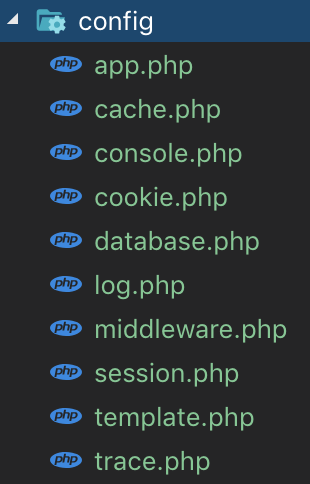
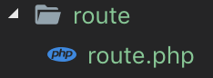
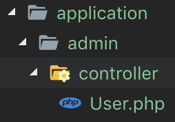
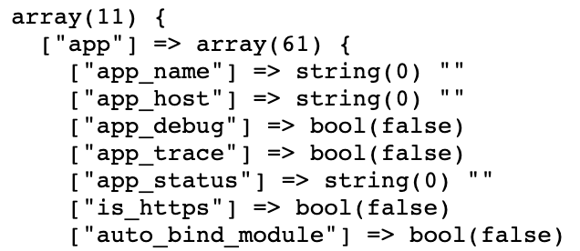
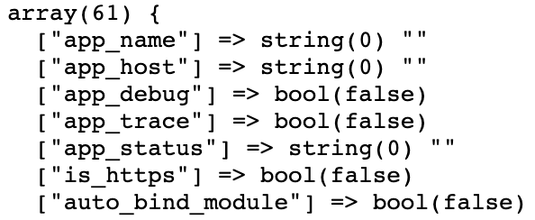

# ThinkPHP配置技巧
---

### 一、配置

* 用config目录取代了5.0的`config.php`文件
* 一级配置名称就是配置文件的名称



* 路由配置`route.php`完全独立出来了



* 模块配置与应用配置完全独立不再合并

### 二、配置获取与设置

```
/*
 获取：Config::get()
 设置：Config::set()
 查询：Config::has()
 助手函数：config()
*/
```
* 示例



```
<?php

namespace app\admin\controller;
use think\facade\Config;

class User
{
    public function get()
    {
        //获取全部的配置项
        // dump(Config::get());

        //仅获取app下面的配置项，app是一级配置项，与config/app.php文件对应
        // dump(Config::get('app.'));

        //仅获取一级配置项，推荐使用pull()
        // dump(Config::pull('app'));

        //获取二级配置项
        // dump(Config::get('app.app_debug'));

        //app是默认的一级配置前缀，所以可以省略
        // dump(Config::get('app_debug'));
        // dump(Config::get('default_lang'));

        //是否有这个配置
        dump(Config::has('default_lang'));

        //查询database一级配置底下的内容
        dump(Config::get('database.hostname'));
    }

    public function set()
    {
        //静态设置就是直接修改配置文件
        //动态设置用的是Config类中的set()方法
        dump(Config::get('app_debug'));
        Config::set('app_debug',true);
        dump(Config::get('app_debug'));
    }
}
```

* 通过 `localhost/admin/user/get` 访问结果如下：
* 一级配置



* 二级配置



### 三、总结

这一章讲了配置相关操作，使用还是挺方便的，学了一些细节，比如app为默认一级域名，可以省略；仅获取一级域名推荐使用`pull()`，因为`get()`函数底层还是调用了`pull()`；每个配置模块都有独立的文件，简单明了，为架构设计点赞。

同时感谢[PHP中文网](http://www.php.cn) 的教学资源...

以上均是自学过程的积累，学到哪记到哪

原创文章，转载请注明出处，谢谢！