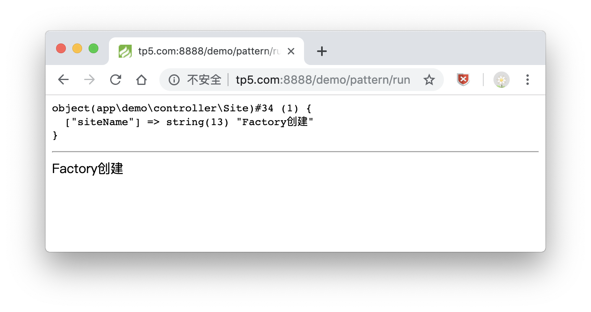
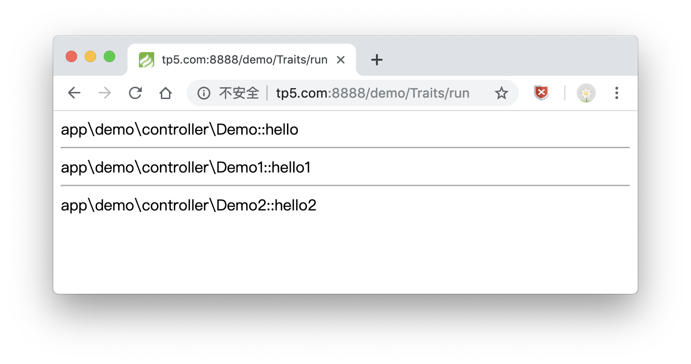
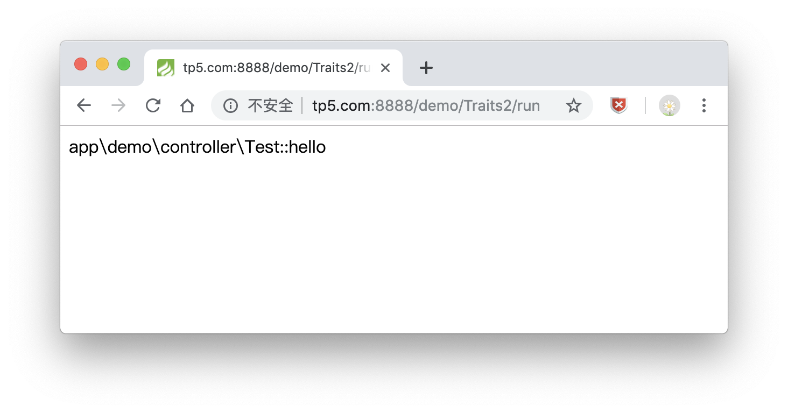
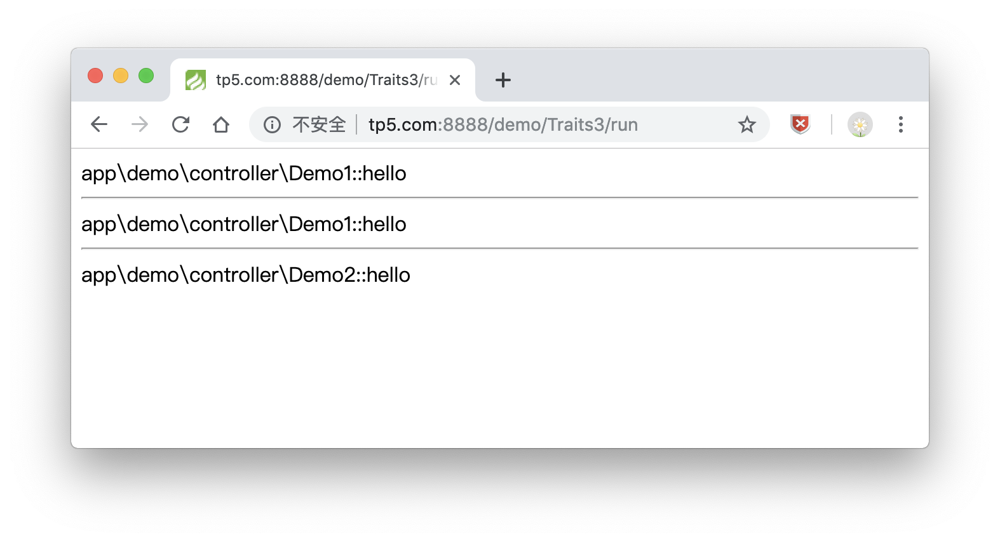

# ThinkPHP设计模式与Trait技术
---

### 设计模式

>单例模式

```
class Site
{
    //属性
    public $siteName;
    //本类的静态实例
    protected static $instance = null;
    //禁用掉构造器
    private function __construct($siteName)
    {
        $this->siteName = $siteName;
    }
    //获取本类唯一实例
    public static function getInstance($siteName='PHP中文网')
    {
        if (!self::$instance instanceof self)
        {
            self::$instance = new self($siteName);
        }
        return self::$instance;
    }
}
```

>工厂模式

```
class Factory
{
    //创建指定类的实例
    public static function create()
    {
        return Site::getInstance('Factory创建');
    }
}
```

>对象注册树

```
/**
 * Class Register
 * 1、注册：set()，把对象挂到树上
 * 2、获取：get()，把对象取下来用
 * 3、注销：_unset()，把对象吃掉
 */
class Register
{
    //创建对象池：数组
    protected static $objects = [];
    //生成对象并上树
    public static function set($alias,$object)
    {
        self::$objects[$alias] = $object;
    }

    //从树上面取下对象
    public static function get($alias)
    {
        return self::$objects[$alias];
    }

    //把树上面对象吃掉
    public static function _unset($alias)
    {
        unset(self::$objects[$alias]);
    }
}
```

>示例

```
class Pattern
{
    public function run()
    {
        //将Site类的实例上树，放到对象池
        Register::set('site',Factory::create());
        //从树上取一个对象下来
        $obj = Register::get('site');
        //查看一下这个对象
        dump($obj); 

        echo '<hr>';
        echo $obj->siteName;
    }
}
```

>运行



### Trait技术 

---

自 PHP 5.4.0 起，PHP 实现了一种代码复用的方法，称为`trait`。

[Trait](http://php.net/manual/zh/language.oop5.traits.php) 是为类似 PHP 的单继承语言而准备的一种代码复用机制。`Trait` 为了减少单继承语言的限制，使开发人员能够自由地在不同层次结构内独立的类中复用` method`。`Trait` 和 `Class` 组合的语义定义了一种减少复杂性的方式，避免传统多继承和 `Mixin` 类相关典型问题。

`Trait` 和 `Class` 相似，但仅仅旨在用细粒度和一致的方式来组合功能。 无法通过 `trait` 自身来实例化。它为传统继承增加了水平特性的组合；也就是说，应用的几个 `Class` 之间不需要继承。

>示例1

```
<?php

namespace app\demo\controller;

class Traits
{
    public function run()
    {
        $obj = new Demo;
        echo $obj->hello();

        echo '<hr>';
        echo $obj->test1();

        echo '<hr>';
        echo $obj->test2();
    }
}

trait Demo1
{
    public function hello1()
    {
        return __METHOD__;
    }
}

trait Demo2
{
    public function hello2()
    {
        return __METHOD__;
    }
}

class Demo
{
    use Demo1,Demo2;
    public function hello()
    {
        return __METHOD__;
    }
    public function test1()
    {
        return $this->hello1();
    }
    public function test2()
    {
        return $this->hello2();
    }
}
```

>运行



>示例2

```
<?php

/**
 * trait优先级问题
 * 1、当前类中的方法与trait类，父类中的方法重名了，怎么办？
 * Demo,Test,Demo1都有hello方法
 * Demo > Demo1 > Test
 * 2、trait类的优先级是高于同名父类方法
 */
namespace app\demo\controller;

class Traits2
{
    public function run()
    {
        $obj = new Demo;
        echo $obj->hello();

        // echo '<hr>';
        // echo $obj->test1();

        // echo '<hr>';
        // echo $obj->test2();
    }
}

trait Demo1
{
    // public function hello()
    // {
    //     return __METHOD__;
    // }
}

trait Demo2
{
    public function hello2()
    {
        return __METHOD__;
    }
}

class Test
{
    public function hello()
    {
        return __METHOD__;
    }
}

class Demo extends Test
{
    use Demo1,Demo2;
    // public function hello()
    // {
    //     return __METHOD__;
    // }
    public function test1()
    {
        return $this->hello1();
    }
    public function test2()
    {
        return $this->hello2();
    }
}
```

>运行



>示例3

```
<?php

/**
 * trait优先级问题
 * 1、当前类中的方法与trait类，父类中的方法重名了，怎么办？
 * Demo,Test,Demo1都有hello方法
 * Demo > Demo1 > Test
 * 2、trait类的优先级是高于同名父类方法
 * 3、当多个trait类中有同名方法，怎么办？
 */
namespace app\demo\controller;

class Traits3
{
    public function run()
    {
        $obj = new Demo;
        echo $obj->hello();

        echo '<hr>';
        echo $obj->test1();

        echo '<hr>';
        echo $obj->test2();
    }
}

trait Demo1
{
    public function hello()
    {
        return __METHOD__;
    }
}

trait Demo2
{
    public function hello()
    {
        return __METHOD__;
    }
}

class Test
{
    public function hello()
    {
        return __METHOD__;
    }
}

class Demo extends Test
{
    use Demo1,Demo2{
        Demo1::hello insteadof Demo2;   //Demo1的hello方法指向Demo2
        Demo2::hello as Demo2Hello;     //Demo2的hello方法取别名Demo2Hello
    }
    // public function hello()
    // {
    //     return __METHOD__;
    // }
    public function test1()
    {
        return $this->hello();
    }
    public function test2()
    {
        return $this->Demo2Hello();
    }
}
```

>运行



### 总结

这一章讲了`设计模式`与`Trait`技术相关操作，`ThinkPHP5.1`中使用了`注册树模式`，新的设计模式给人新的架构思想，需要着重了解下，之后章节会说到，其他的模式都应该有接触过。`Traits`是一种代码复用机制，帮助我们写出复用性更高的代码，要了解下，多理解示例代码，自己写一下。

同时感谢[PHP中文网](http://www.php.cn) 的教学资源...

以上均是自学过程的积累，学到哪记到哪

原创文章，转载请注明出处，谢谢！