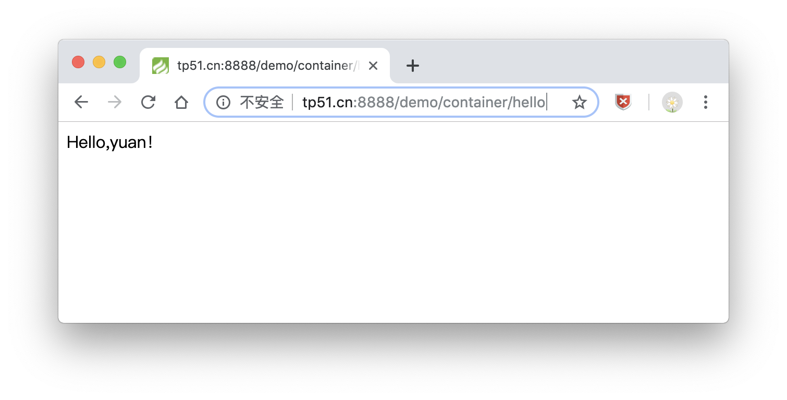
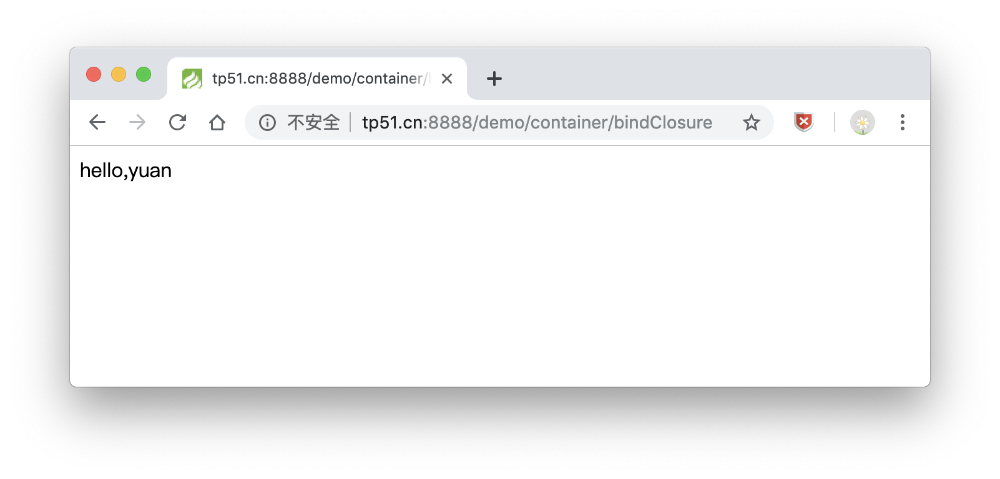

# 容器/依赖注入/静态代理/请求对象
---

### 容器与依赖注入的原理

1. 任何的URL访问，最终都是定位到控制器，由控制器中某个具体的方法去执行
2. 一个控制器对应着一个类，如果这些类需要进行统一管理，怎么办？
3. 容器来进行类管理，还可以将类的实例(对象)作为参数，传递给类方法，自动触发依赖注入

* 依赖注入：将对象类型的数据，以参数的方式传到方法的参数列表
* URL访问：通过GET方式将数据传到控制器指定的方法中，但是只能传字符串，数值
* 如果要传一个对象到当前方法中？怎么办？
* 依赖注入：解决了向类中的方法传递对象的问题

>依赖注入示例

```
protected $user;

public function __construct(UserModel $user)
{
    $this->user = $user;
}

/* 和上面是等价的
public function __construct(){
    $user = new UserModel();
    return $user->name;
}
*/

public function hello()
{
    return 'Hello,' . $this->user->name . '！';
} 
```



在`ThinkPHP`的设计中，`think\App`类虽然自身不是容器，但却是一个容器管理类，可以完成容器的所有操作。

`V5.1.14+`版本开始，应用类自身就是一个容器实例。

这里演示的是通过助手函数来进行绑定，当然也可以用`think\Container`操作
  
* 调用和绑定的标识必须保持一致（包括大小写）
* 你可以绑定一个类到容器中（第一个参数直接传入类名）
* 只要调用过一次后就会自动绑定
* 绑定的类标识可以自己定义（只要不冲突）
     
>容器绑定示例

```
public function bind()
{
    // 绑定类库标识
    bind('user','app\demo\model\UserModel');

    // 快速调用（自动实例化）
    $user = app('user');
    $user->name = '123';

    echo '$user->name , ' . $user->name . '！<br>';
    
    //容器中已经调用过的类会自动使用单例
    //除非你使用下面的方式强制重新实例化。
    //每次调用都会重新实例化
    $user = app('user',true);

    echo '$user->name , ' . $user->name . '！<br>';

    $user = app('user',['带参数实例'],true);

    echo '$user->name , ' . $user->name . '！';
}

```


>闭包绑定

```
/**
 * 可以把一个闭包方法绑定到容器中
 */
public function bindClosure()
{
    bind('sayHello', function ($name) {
        return 'hello,' . $name;
    });
    echo app('sayHello',['yuan']);
}
```



### 总结

这一章讲了`容器/依赖注入/静态代理/请求对象`技术相关操作，

* `ThinkPHP5.1`中使用了`注册树模式`，这里的容器就是注册树模式，之前讲过应该很熟悉了。
* `依赖注入`就是将对象类型的数据，以参数的方式传到方法的参数列表，没什么高深的东西。
* `静态代理`
* `请求对象`

同时感谢[PHP中文网](http://www.php.cn) 的教学资源...

以上均是自学过程的积累，学到哪记到哪

原创文章，转载请注明出处，谢谢！