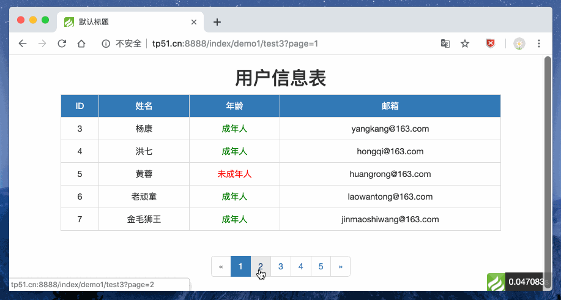
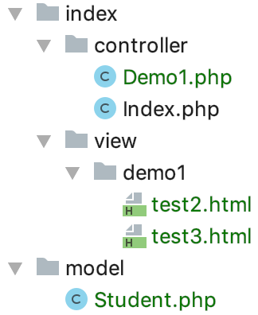
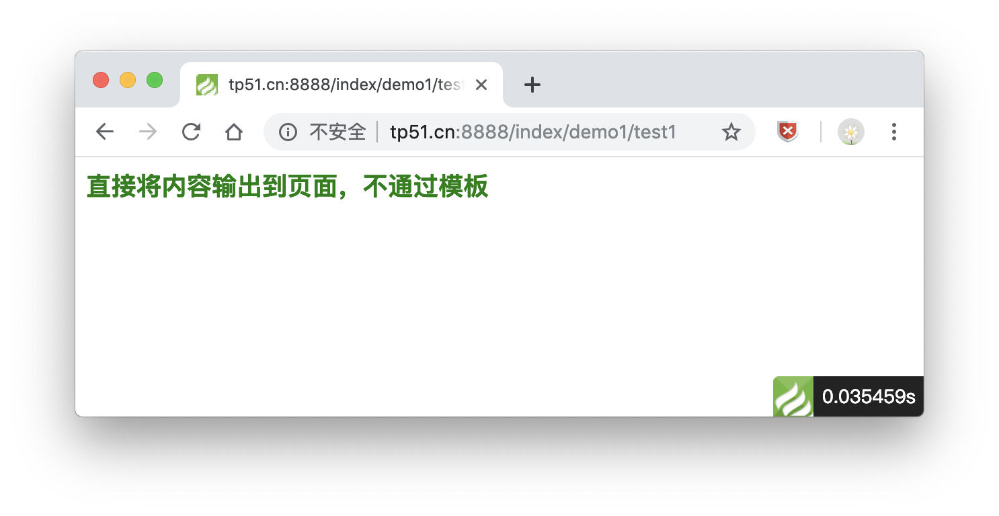
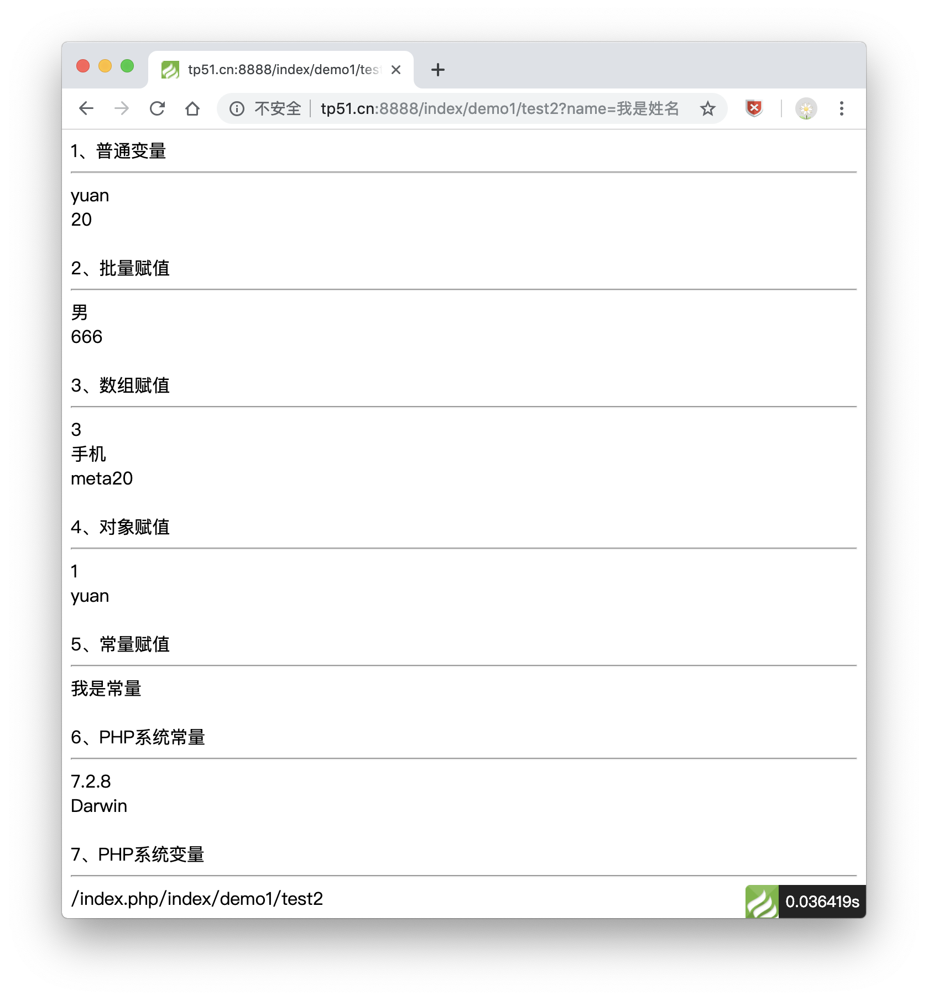

# ThinkPHP模板变量与常用标签

> 模板变量可以理解为model->view数据的传递<br>
> 常用标签可以获取配置、系统、请求等一系列参数，了解下都能干什么就行

### 项目示例

> 通过模板变量实现列表分页功能



### 一、模板变量

1、项目目录结构

打开`controller\Demo1.php`查看具体示例代码



2、将内容输出到页面，不通过模板

```
public function test1()
{
    //直接将内容输出到页面，不通过模板
    $content = '<h3 style="color: green">直接将内容输出到页面，不通过模板</h3>';
	//return $this->display($content);

    //推荐使用，因为过程更加清晰，不隐藏细节
    return $this->view->display($content);

    //静态代理 
    //导入think\facade\View;
	//return View::display($content);
}
```

> 示例效果



3、使用视图将数据进行输出：`fetch()` 模板变量赋值：`assign()`
 
```
public function test2()
{
    //1、普通变量
    $this->view->assign('name','yuan');
    $this->view->assign('age',20);

    //2、批量赋值
    $this->view->assign([
        'sex'=>'男',
        'salary'=>666
    ]);

    //3、array
    $this->view->assign('goods',[
        'id'=>3,
        'name'=>'手机',
        'model'=>'meta20'
    ]);

    //4、object
    $obj = new \stdClass();
    $obj->id = 1;
    $obj->name = 'yuan';
    $this->view->assign('info',$obj);

    //5、const
    define('SITE_NAME','我是常量');

    //在模板中输出数据
    //模板默认的目录位于当前模块的view目录，模板文件默认位于以当前控制器命名的目录中
    return $this->fetch();
}
```

> `test2.html`文件源码

```
1、普通变量<hr>
{$name}<br>
{$age}<br>

<br>
2、批量赋值<hr>
{$sex}<br>
{$salary}<br>

<br>
3、数组赋值<hr>
{$goods.id}<br>
{$goods.name}<br>
{$goods.model}<br>

<br>
4、对象赋值<hr>
{$info->id}<br>
{$info->name}<br>

<br>
5、常量赋值<hr>
{$Think.const.SITE_NAME}<br>

<br>
6、PHP系统常量<hr>
{$Think.const.PHP_VERSION}<br>
{$Think.const.PHP_OS}<br>

<br>
7、PHP系统变量<hr>
{$Think.server.php_self}<br>
{$Think.server.session.id}<br>
{$Think.server.get.name}<br>
{$Think.server.post.name}<br>
```

> 示例效果



4、实现分页列表效果

```
public function test3(){
	//$data = \app\model\Student::all();
    //分页
    $data = \app\model\Student::paginate(5);
    $this->view->assign('data',$data);
    return $this->view->fetch();
}
```

> `test3.html`文件源码

```
<!DOCTYPE html>
<html lang="en">
<head>
    <meta charset="UTF-8">
    <title>{$title|default="默认标题"}</title>
    <link rel="stylesheet" href="/static/css/bootstrap.min.css">
    <script src="/static/js/jquery-3.3.1.min.js"></script>
    <script src="/static/js/bootstrap.min.js"></script>
</head>
<body>
<div class="container">
    <div class="row">
        <div class="col-md-2"></div>
        <div class="col-md-8">
            <h2 class="text-center">用户信息表</h2>
            <table class="table table-default table-bordered table-hover text-center">
                <tr class="bg-primary">
                    <td>ID</td>
                    <td>姓名</td>
                    <td>年龄</td>
                    <td>邮箱</td>
                </tr>
                {volist name="data" id="list"}
                <tr>
                    <td>{$list.id}</td>
                    <td>{$list.name}</td>
                    <!--条件判断-->
                    <td>
                        {if $list.age > 18}
                        <span style="color: green">成年人</span>
                        {else/}
                        <span style="color: red">未成年人</span>
                        {/if}
                    </td>
                    <td>{$list.email}</td>
                </tr>
                {/volist}
            </table>
            <div class="col-md-2"></div>
            <!--分页条-->
            <div class="text-center">
                {$data|raw}
            </div>
        </div>
    </div>
</div>
</body>
</html>
```

**【注意】** 

1、`bootstrap`和`jQuery`的文件导入到根目录`/pubilc/static`下即可

2、`{$title|default="默认标题"}` 可以使用语法处理默认值的问题

### 总结

这一章讲了`模板变量与常用标签`技术相关操作，

* `模板变量`告诉我们怎么传递数据，视图将数据进行输出：`fetch()` 模板变量赋值：`assign()`，示例代码参考`index\controller\Demo1.php`
* `常用标签`告诉我们如何获取配置、系统、请求等一系列隐藏参数

同时感谢[PHP中文网](http://www.php.cn) 的教学资源...

以上均是自学过程的积累，学到哪记到哪

原创文章，转载请注明出处，谢谢！