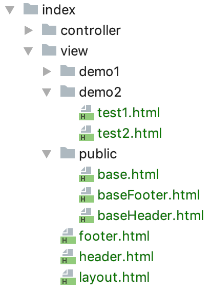
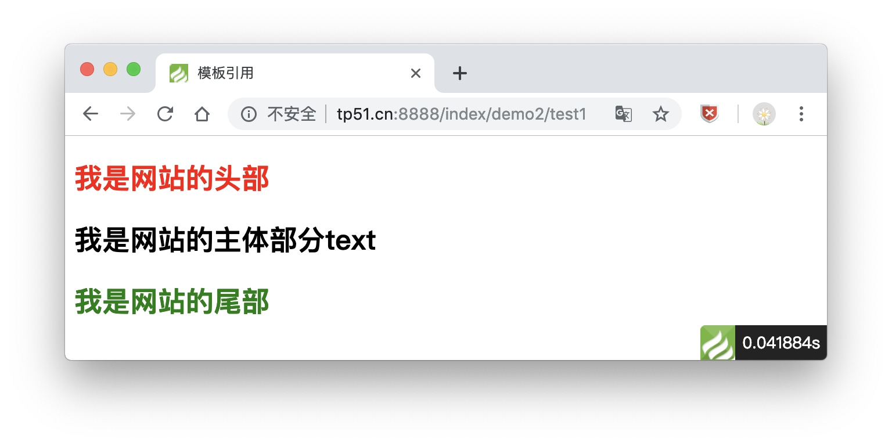
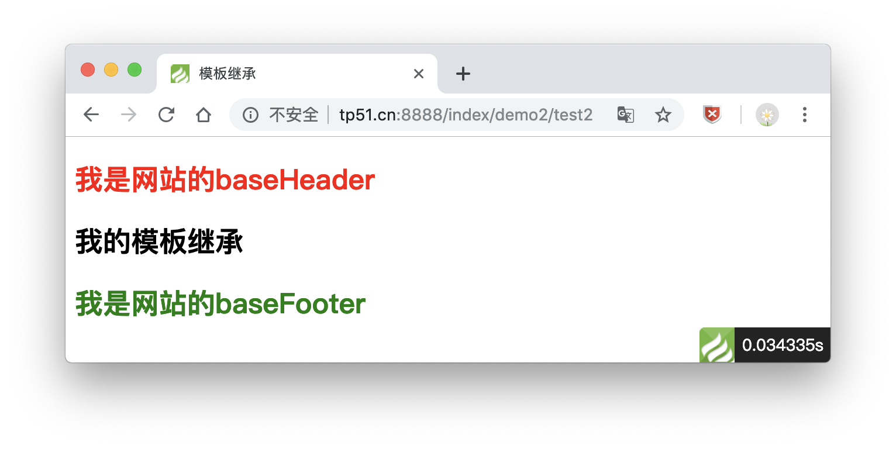

# 模板布局与继承

> ThinkPHP的模板引擎内置了布局模板功能支持，可以方便的实现模板布局以及布局嵌套功能。

### 项目目录



### 全局配置方式

这种方式仅需在项目配置文件中添加相关的布局模板配置，就可以简单实现模板布局功能，比较适用于全站使用相同布局的情况，需要配置开启`layout_on` 参数（默认不开启），并且设置布局入口文件名`layout_name`（默认为`layout`）。

打开`config/template.php`进行设置

```
// 开启全部模板布局
'layout_on'    => true,
// 全局模板布局文件名
'layout_name'  => 'layout',
// 自定义标签
'layout_item'  => '{__TEXT__}',
```

view目录下创建 `demo2\test1.html`、`header.html`、`footer.html`、`layout.html`

> header.html源码

```
<!DOCTYPE html>
<html lang="en">
<head>
    <meta charset="UTF-8">
    <title>模板引用</title>
</head>
<body>
<h2 style="color: red">我是网站的头部</h2>
```

> footer.html源码

```
<h2 style="color: green">我是网站的尾部</h2>
</body>
</html>
```

> layout.html源码

```
{include file="header" /}

<!--默认 {__CONTENT__}-->
{__TEXT__}

{include file="footer" /}
```

> demo2\test1.html源码

```
<h2>我是网站的主体部分text</h2>
```

> 示例效果



### 模板继承

view目录下创建 `demo2\test2.html`、`public\base.html`、`public\baseHeader.html`、`public\baseFooter.html`

> base.html源码

```
{include file="public/baseHeader" /}

{block name="body"}
主体
{/block}

{include file="public/baseFooter" /}
```

> baseHeader.html源码

```
<!DOCTYPE html>
<html lang="en">
<head>
    <meta charset="UTF-8">
    <title>模板继承</title>
</head>
<body>
<h2 style="color: red">我是网站的baseHeader</h2>
```

> baseFooter.html源码

```
<h2 style="color: green">我是网站的baseFooter</h2>
</body>
</html>
```

> test2.html源码

```
{extend name="public/base"}

{block name="body"}
<!--{__block__} 用于显示母版中的内容-->
<h2>我的模板继承</h2>
{/block}

<h2>block外的内容是不显示的！！！</h2>
```

> 示例效果



**【注意】**

相关内容需要写在`block`标签中间，写在外面页面上无任何效果！！！

### 总结

这一章讲了`模板布局与继承`技术相关操作，

* `模板布局`需要在`config/template.php`文件中进行配置，相对不是很灵活
* `模板继承`创建基类，继承使用相关更灵活，记住作用域需要在`block`中即可

同时感谢[PHP中文网](http://www.php.cn) 的教学资源...

以上均是自学过程的积累，学到哪记到哪

原创文章，转载请注明出处，谢谢！