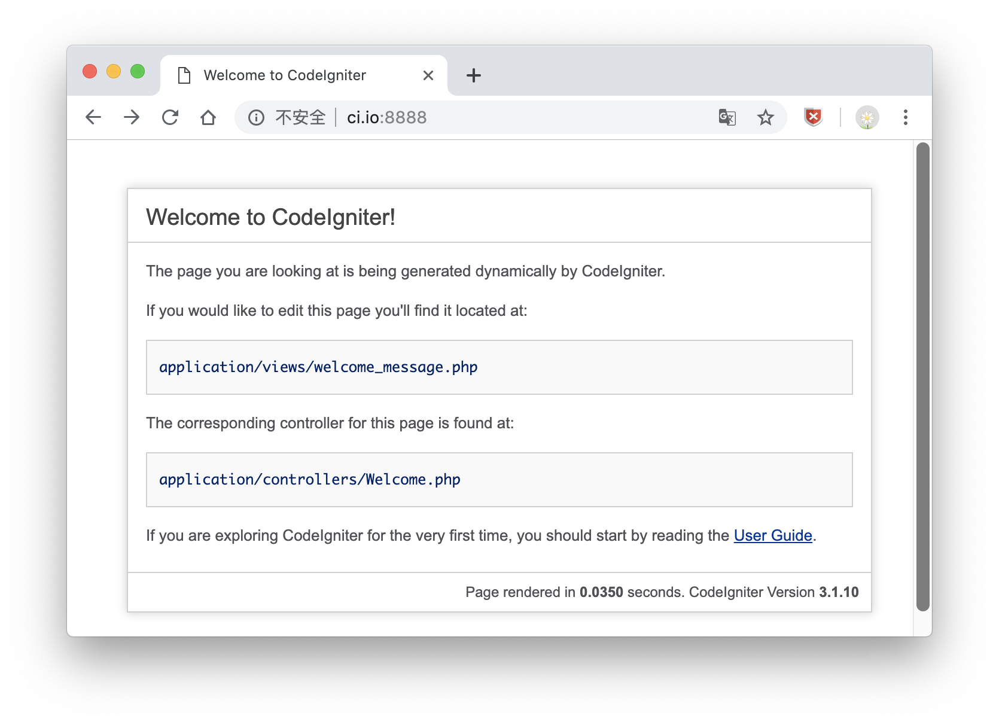
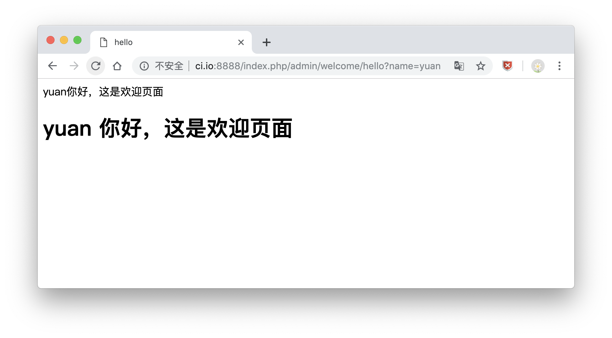
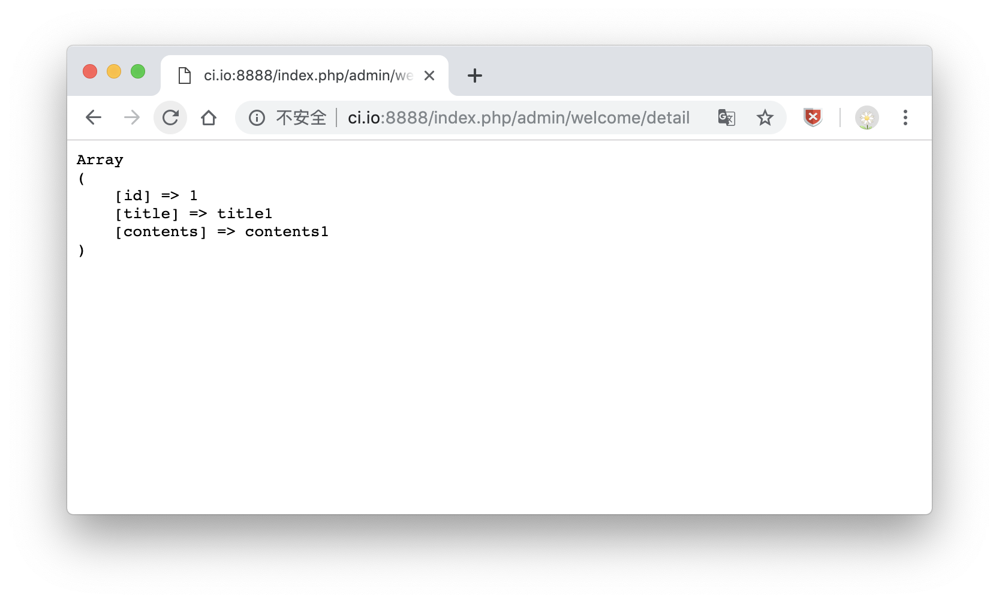

# 优雅的 CodeIgniter
> [CodeIgniter](https://codeigniter.org.cn) 是一个小巧但功能强大的 PHP 框架，作为一个简单而“优雅”的工具包，它可以为开发者们建立功能完善的 Web 应用程序。

### 一、访问项目

直接输入项目地址，可看到默认欢迎页面，有用户手册信息等。



也可在`config/routes.php`修改首页默认显示

```
$route['default_controller'] = 'welcome';
```

### 二、CI控制器

控制器就是`controllers`目录下面的类 <br>
1、文件名的第一个字母一定要大写 <br>
2、类型和文件名要一致 <br>
3、一定要继承自`CI_Controller`类 <br>

控制器的子目录 <br>
访问子目录中的控制器，在url上要加上子目录的名称

设置默认控制器 <br>
默认控制器设置：`config/routes.php`中设置

控制器的构造函数 <br>
`parent::__construct();`

命名不要和[系统保留字](https://codeigniter.org.cn/user_guide/general/reserved_names.html)重名 <br>

```
<?php

//安全性设置
defined('BASEPATH') OR exit('No direct script access allowed');

class Welcome extends CI_Controller {
	public function index()
	{
		//默认加载方法
	}
}

>
```

### 三、CI视图

CI视图是一个Web页面 <br>
CI默认的视图文件是`.php`的文件，放在`views`目录中。 <br>
视图只能在控制器中加载来访问
`$this->load->view('视图文件名')`

```
public function hello()
{
	//参数获取
	$this->name = $this->input->get('name'); 
	echo $this->name.'你好，这是欢迎页面';

	//页面传值1
	// $this->load->view('admin/welcome_hello',$this);

	$data['name'] = 'name';
	//页面传值2
	// $this->load->view('admin/welcome_hello',$data);

	//将视图作为数据返回
	echo $this->load->view('admin/welcome_hello','',TRUE);
}
```

**welcome_hello.php**

```
<!DOCTYPE html>
<html lang="en">
<head>
	<meta charset="utf-8">
    <title>hello</title>
</head>
<body>
    <!--传值1接收 <?=$name?> -->
    <!--传值2接收 <?php echo $name; ?>  -->
    <h1><?=$name?> 你好，这是欢迎页面</h1>
</body>
</html>
```



### 四、CI模型

CI模型是专门和数据库打交道的类，一般封装了对数据库进行增、删、改、查的方法。

模型文件一般放在`models`目录下面
CI的模型不是必须的，在实际开发中最好加上，以符合`MVC`规范。

**models/Article_model.php**

```
<?php
class Article_model extends CI_Model{
    public function detail($id)
    {
        //加载数据库的分组配置
        $this->load->database('default');
        //选择表
        $this->db->from('article');
        //查询字段
        $this->db->select('id,title,contents');
        //指定查询条件
        $this->db->where(array('id'=>$id));
        //获取查询结果
        $query = $this->db->get();
        return $query->row_array();      //单条
        // return $query->result_array();   //多条
        // return $query->result();         //多个对象
        // return $query->row();            //单个对象
    }
}
```

调用方法

```
public function detail()
{
	//加载模型
	// $this->load->model('article_model');
	//配置自动加载：config/autoload.php $autoload['model'] = array('article_model');
	//调用模型中的方法
	$result = $this->article_model->detail(1);
	echo '<pre>';
	print_r($result);
}
```



## 总结

这一章讲了`CodeIgniter`框架相关操作，
     
* 控制器类要继承自`CI_Controller`，文件名的第一个字母一定要大写，类型和文件名要一致，要知道如何获取参数，路由配置等。
* 视图文件是.php的文件。放在views目录中，视图只能在控制器中加载来访问`$this->load->view('视图文件名')`，要知道如何**传递和获取参数**，其他的交给html搞定。
* 模型文件一般放在models目录下面，更多的是和数据库进行交互，获取数据返回。

同时感谢[PHP中文网](http://www.php.cn) 的教学资源...

以上均是自学过程的积累，学到哪记到哪

原创文章，转载请注明出处，谢谢！